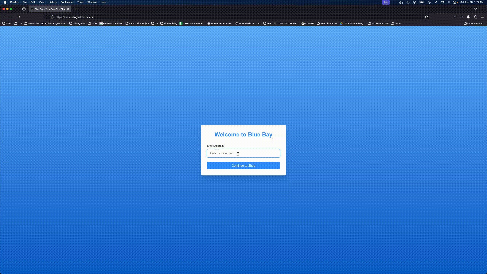

# DevOps_Final_Infrastructure

This is the Infrastructure repository for the DevOps Final project. This project is hosted in AWS Learner Lab so some steps may be different in the regular AWS environment due to permission issues.

In this project, we show how to perform blue/green deployment in Kubernetes for a project made up of more than 3 services hosted in AWS. The infrastructure and workflows in this project enables us to promote the project from local development to QA to UAT and finally to Prod. The process is all automated based on the Github Actions defined.

The project is made up of the following 4 microservices and is a simple implementation of an ecommerce website:
- [Frontend](https://github.com/lawrenceslng/DevOps_Final_Frontend)
- [Order](https://github.com/lawrenceslng/DevOps_Final_Order_Service)
- [Product](https://github.com/lawrenceslng/DevOps_Final_Product_Service)
- [Cart](https://github.com/lawrenceslng/DevOps_Final_Cart_Service)

See the README in each individual repository for setup information.



## Technologies Used

The following AWS resources are used:
- EKS
- EC2
- ECR
- Route 53
- ALB + Target Groups
- RDS
- ElastiCache

## Prerequisites

The following should be downloaded:
- [Packer](https://developer.hashicorp.com/packer)
- [Terraform](https://developer.hashicorp.com/terraform) 
- [AWS CLI](https://aws.amazon.com/cli/)

In AWS Learner's Lab, download the PEM file for the SSH credentials and move it into the root directory. Make sure to do `chmod 600 <PEM_FILE>` and (optionally) `ssh-add <PEM_FILE>`.

Run the command `chmod +x scripts/*sh` to make the scripts executable.

Create `scripts/.env_var` using `.env_var.example` as a guide. You can find this information from the AWS Learner's Lab.

Create a [Github Personal Access Token](https://docs.github.com/en/authentication/keeping-your-account-and-data-secure/managing-your-personal-access-tokens#creating-a-fine-grained-personal-access-token) and put it in `.env` following `.env.example`. The Github PAT should have access to create PR and perform merges. 

Make sure Github Repo Settings → Actions → General → Workflow permissions

    ✔️ Select: "Read and write permissions"

**NOTE ON EVERY LAB START**

Because the Learner's lab environment is not persistent, the following needs to be done during every start.

1. Run `/scripts/01-setup_env.sh`
2. Download the .pem file and place in Infra root directory
3. Base64 encode the key with `base64 -i labsuser.pem` and copy paste to Github secrets (SSH_PRIVATE_KEY)
4. Update the following secrets as well:
    - AWS_ACCESS_KEY_ID
    - AWS_SECRET_ACCESS_KEY
    - AWS_SESSION_TOKEN
5. Make sure to run `aws eks update-kubeconfig --region us-east-1 --name <YOUR_EKS_CLUSTER_NAME>` to make sure your kubectl locally is pointing to correct cluster
6. Change the private ip addresses in uat and prod load balancer target groups. Use `kubectl get nodes -o wide` to find the private ip addresses.

## Day 0 Setup

To setup your AWS architecture, simply run through the numbered shell scripts in `scripts` in order from 01 to 08. After step 02, find the AMI ID created by Packer and put it in `terraform/variables.tf`. Also change the domain name to your own or skip the Route 53 setup. These scripts uses packer, terraform, and aws cli commands to create all the necessary infrastructure.

Some manual steps for setting up the AWS Certificate manager for route 53 remains and there may be some additional security group rules remaining to be configured.

The ALB and target groups need to be created manually to point the created private EC2's IPs.

The EKS Cluster needs security group with inbound rule from 0.0.0.0/0.

Set up the following Github Secrets in this repo, you can find these information in `scripts/eks-args.env` or in AWS Learner's Lab or console:

| Key  | Value |
| ------------- | ------------- |
| AWS_ACCESS_KEY_ID |   |
| AWS_ACCOUNT_ID     |   |
| AWS_ACCOUNT_REGION  |   |
| AWS_EC2_KEY_PAIR_NAME |   |
| AWS_EKS_CLUSTER_NAME |   |
| AWS_HOSTED_ZONE_ID |   |
| AWS_PRIVATE_SUBNET_ID |   |
| AWS_PUBLIC_SUBNET_ID |   |
| AWS_PUBLIC_SUBNET_ID_2  |   |
| AWS_PUBLIC_SUBNET_ID_3  |   |
| AWS_QA_ACM_CERT_ARN |   |
| AWS_QA_AMI  |   |
| AWS_QA_SECURITY_GROUP_ID  |   |
| AWS_SECRET_ACCESS_KEY  |   |
| AWS_SESSION_TOKEN |   |
| AWS_VPC_ID  |   |
| DB_HOST  |   |
| DB_PASSWORD  |   |
| DB_USER  |   |
| INFRA_REPO_PAT  |   |
| REDIS_URL  |   |
| SSH_PRIVATE_KEY  |   |

Once the infrastructure is setup, you can trigger the `Nightly_Build` Github Action to create the initial images in ECR. Replace the repository path in the Github Action as needed.

You can then use kubectl to create the prod namespace and launch the services and deployments:

```
kubectl apply -f k8s/prod/namespace.yaml
kubectl apply -f k8s/prod/service
kubectl apply -f k8s/prod/deployment
```

For the deployment files, replace the variables as necessary and use color blue.

## Day 1

Once the site is launched you are ready to perform the promotion flows using the available Github Actions.

## Promotion Flow Demo

- run Nightly Build workflow manually
- run Deploy to QA workflow manually

- kubectl config current-context
- kubectl get ns
- ./promote-to-uat.sh
- kubectl get ns
- kubectl get pods -n uat
- kubectl get services -n uat

- kubectl get pods -n prod 
- kubectl get services -n prod

- ./promote-to-green.sh
- kubectl get ns
- kubectl get pods -n prod 
- kubectl get services -n prod

- ./promote-to-blue.sh
- kubectl get pods -n prod 
- kubectl get services -n prod

## To Do

- maybe change `Deploy_to_UAT.yaml` to create the ALB dynamically like done in `Deploy_to_QA.yaml`

## Useful Commands

```
kubectl describe pod <pod_name> -n <namespace>
kubectl exec -it <pod_name> -n <namespace> -- /bin/sh
kubectl get pods -n <namespace> -o wide
kubectl get ns
kubectl get services -n <namespace>
kubectl delete deployment <deployment_name> -n <namespace>>
kubectl delete service <service_name> -n <namespace>>
kubectl apply -f <file_name>
```